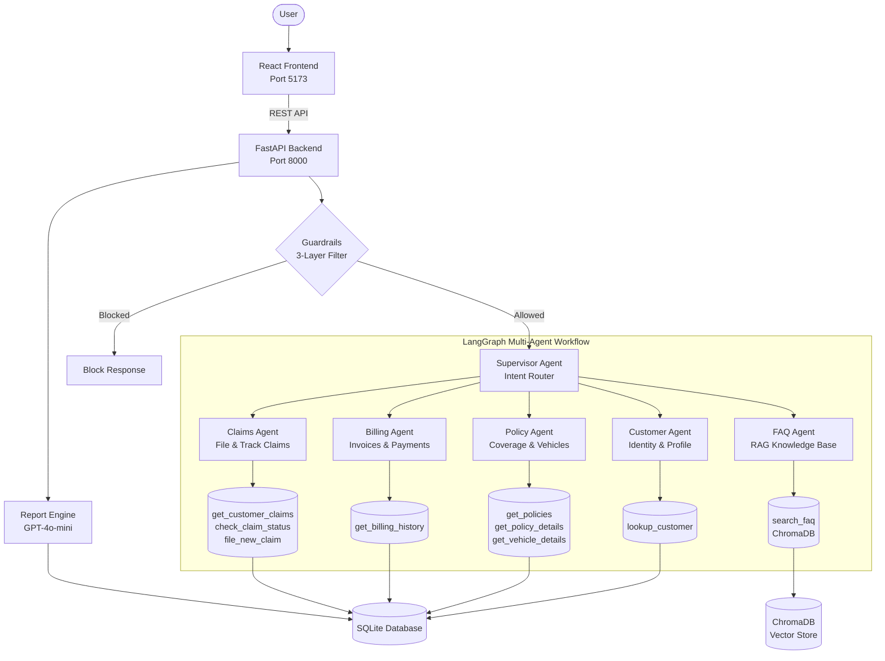
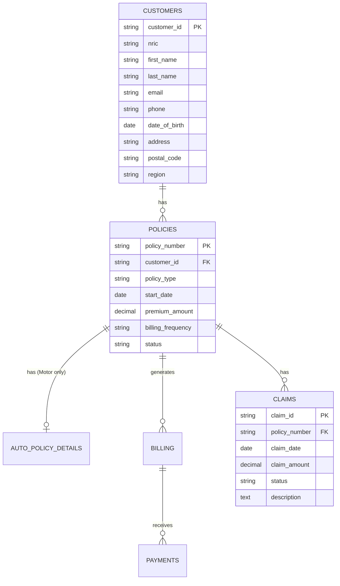

<p align="center">
  
  
  
  
  
  
</p>

# InsureAI — Multi-Agent Insurance Chatbot

An AI-powered insurance support chatbot built for the **Singapore market**. It uses a **multi-agent LangGraph supervisor architecture** with five specialized agents, each responsible for a distinct insurance domain. The system includes real-time chat, a three-layer security guardrail, and an AI-generated Executive Summary Report with charts and PDF export.

---

## Table of Contents

- [Project Overview](#project-overview)
- [Architecture](#architecture)
- [Key Features](#key-features)
- [Tech Stack](#tech-stack)
- [Repository Structure](#repository-structure)
- [Component Breakdown](#component-breakdown)
- [Installation & Setup](#installation--setup)
- [How to Run](#how-to-run)
- [Configuration](#configuration)
- [API Reference](#api-reference)
- [Example Usage](#example-usage)
- [Database Schema](#database-schema)
- [Testing](#testing)
- [Deployment](#deployment)
- [Troubleshooting](#troubleshooting)
- [Roadmap](#roadmap)
- [Contributing](#contributing)
- [License](#license)

---

## Project Overview

### The Problem

Insurance customers frequently need quick answers about their policies, billing, claims, and general insurance concepts. Traditional call centers are expensive, slow, and unavailable 24/7.

### The Solution

InsureAI is a **conversational AI assistant** that routes customer queries to the right specialist agent automatically. A supervisor LLM analyzes user intent and dispatches to one of five domain-specific agents, each with access to appropriate database tools and security-scoped data access.

### How It Works

1. User logs in by selecting their profile from 1,000+ demo customers
2. A **silent "Who am I?" query** runs at login to establish identity context
3. Every message passes through a **three-layer guardrail** (regex + LLM semantic filter)
4. The **Supervisor Agent** routes the message to the correct specialist
5. The specialist agent uses **tool calls** to query the SQLite database
6. Each tool enforces **ownership verification** — users can only access their own data
7. The response flows back through the graph to the user

---

## Architecture



---

## Key Features

### Multi-Agent Routing
A supervisor LLM classifies user intent and routes to the appropriate specialist agent. Each agent has access only to the tools relevant to its domain.

### Three-Layer Security Guardrail
| Layer | Type | Purpose |
|-------|------|---------|
| 1 | Regex pre-filter | Blocks SQL injection, jailbreak patterns |
| 2 | LLM semantic guard | Validates intent (off-topic, prompt injection, unauthorized data access) |
| 3 | Tool-level ownership | Each database tool verifies `authenticated_customer_id` |

### Executive Summary Report
AI-generated report with customer profile, policy portfolio, billing status, and claims history. Includes interactive Recharts visualizations (bar charts, pie charts) and PDF export via html2canvas + jsPDF.

### Real-Time Chat Interface
- Agent badge indicators showing which specialist handled the response
- Tool call tracing panel for transparency
- Guardrail block notices with friendly explanations
- Markdown rendering for AI responses
- Typing indicator with animation
- Dark mode support
- Mobile-responsive sidebar

### FAQ Knowledge Base (RAG)
22 Singapore insurance FAQs stored in ChromaDB with semantic search. Covers NCD, COE, GIRO, PayNow, MAS, coverage types, and claim filing procedures.

### Session-Scoped Report Caching
Reports are cached per session to avoid redundant LLM calls. Cache clears on new conversation or sign-out.

---

## Tech Stack

### Backend

| Technology | Purpose |
|-----------|---------|
| **FastAPI** | REST API server |
| **LangGraph** | Multi-agent orchestration with state graph |
| **LangChain** | LLM framework and tool integration |
| **GPT-4o-mini** | Language model (supervisor, agents, guardrails, report narrative) |
| **SQLite** | Structured customer/policy/billing/claims data |
| **ChromaDB** | FAQ vector store for semantic search |
| **Pydantic** | Request validation and structured LLM output |

### Frontend

| Technology | Purpose |
|-----------|---------|
| **React 19** | UI framework |
| **TypeScript** | Type safety |
| **Vite 7** | Build tooling and dev server |
| **Tailwind CSS 4** | Utility-first styling |
| **shadcn/ui + Radix UI** | Accessible component primitives |
| **Zustand 5** | Lightweight state management |
| **React Router 7** | Client-side routing |
| **Recharts 3** | Data visualization (charts) |
| **Framer Motion** | UI animations |
| **Axios** | HTTP client |
| **jsPDF + html2canvas** | PDF export |
| **react-markdown** | Markdown rendering in chat |

---

## Repository Structure

```
insure-ai/
├── backend/
│   ├── api.py                    # FastAPI server & endpoints
│   ├── agent_supervisor.py       # LangGraph state graph & agent nodes
│   ├── guardrails.py             # 3-layer input validation
│   ├── report.py                 # Executive report generator
│   ├── customer_tools.py         # Customer lookup tool
│   ├── policy_tools.py           # Policy & coverage tools
│   ├── claims_tools.py           # Claims management tools
│   ├── billing_tools.py          # Billing & invoice tools
│   ├── auto_tools.py             # Vehicle details tool (motor policies)
│   ├── rag_tools.py              # FAQ semantic search tool
│   ├── requirements.txt          # Python dependencies
│   ├── db/
│   │   ├── setup.py              # Database schema + 1000 synthetic users
│   │   ├── database.py           # SQLite connection manager
│   │   └── er_diagram.md         # Entity relationship documentation
│   └── vectordb/
│       ├── vector_db.py          # ChromaDB initialization
│       └── faq_data.json         # 22 Singapore insurance FAQs
│
├── frontend/
│   ├── package.json
│   ├── vite.config.ts
│   ├── tsconfig.json
│   └── src/
│       ├── App.tsx               # Route configuration
│       ├── main.tsx              # Entry point
│       ├── index.css             # Tailwind + print styles
│       ├── api/                  # API client functions
│       │   ├── client.ts         # Axios instance (base URL)
│       │   ├── authApi.ts        # Login & user list
│       │   ├── chatApi.ts        # Chat messaging
│       │   └── reportApi.ts      # Report generation
│       ├── types/
│       │   └── index.ts          # TypeScript interfaces
│       ├── stores/               # Zustand state management
│       │   ├── authStore.ts      # Authentication state
│       │   ├── chatStore.ts      # Chat messages state
│       │   ├── reportStore.ts    # Report data & modal state
│       │   ├── topicsStore.ts    # Suggested topics config
│       │   └── uiStore.ts       # Sidebar visibility
│       ├── pages/
│       │   ├── LandingPage.tsx   # Marketing landing page
│       │   ├── LoginPage.tsx     # User selection & login
│       │   └── ChatPage.tsx      # Main chat interface
│       └── components/
│           ├── auth/             # Login UI (combobox, preview card)
│           ├── chat/             # Chat interface components
│           ├── report/           # Report dialog & sections
│           ├── landing/          # Landing page sections
│           ├── layout/           # Header, footer, skip link
│           ├── common/           # Theme toggle, utilities
│           └── ui/               # shadcn/ui primitives
│
├── .env.example                  # Environment variable template
├── .gitignore                    # Git ignore rules
└── PUBLISH_TO_GITHUB.md          # GitHub publishing guide
```

---

## Component Breakdown

### Backend Modules

| Module | Responsibility |
|--------|---------------|
| `api.py` | FastAPI server with 6 REST endpoints, session management, CORS, agent detection |
| `agent_supervisor.py` | LangGraph `StateGraph` with supervisor routing, 5 agent nodes, 5 tool nodes, `SecureToolNode` wrapper |
| `guardrails.py` | Regex pre-filter + LLM semantic guard with `GuardrailVerdict` structured output |
| `report.py` | Aggregates DB data + GPT-4o-mini narrative into `ExecutiveSummary` structured output |
| `customer_tools.py` | `lookup_customer` — resolves email to profile |
| `policy_tools.py` | `get_customer_policies`, `get_policy_details` — policy data with ownership checks |
| `auto_tools.py` | `get_vehicle_details` — VIN, make, model, license plate for motor policies |
| `billing_tools.py` | `get_billing_history` — invoices, due dates, payment status |
| `claims_tools.py` | `get_customer_claims`, `check_claim_status`, `file_new_claim` — full claims lifecycle |
| `rag_tools.py` | `search_faq` — ChromaDB cosine similarity search over 22 FAQs |
| `db/setup.py` | Generates schema + 1,000 synthetic Singapore customers with realistic data |
| `vectordb/vector_db.py` | Initializes ChromaDB collection from `faq_data.json` |

### Frontend Pages

| Page | Route | Description |
|------|-------|-------------|
| `LandingPage` | `/` | Marketing page with feature highlights and trust indicators |
| `LoginPage` | `/login` | Searchable combobox with 1,000+ users, preview card, policy type filter |
| `ChatPage` | `/chat` | Full chat interface with sidebar, quick actions, report dialog |

### Key Frontend Components

| Component | Location | Purpose |
|-----------|----------|---------|
| `ChatContainer` | `components/chat/` | Scrollable message list with auto-scroll |
| `MessageBubble` | `components/chat/` | Renders user/AI messages with markdown support |
| `AgentBadge` | `components/chat/` | Shows which specialist agent responded |
| `AgentTracePanel` | `components/chat/` | Expandable tool call details |
| `GuardrailNotice` | `components/chat/` | Blocked message with explanation |
| `ChatSidebar` | `components/chat/` | Navigation, new conversation, report button, sign out |
| `QuickActions` | `components/chat/` | Configurable suggested topic buttons |
| `ReportDialog` | `components/report/` | Full-screen modal with PDF export |
| `PolicyPortfolioSection` | `components/report/sections/` | Recharts bar + pie charts |
| `ClaimsHistorySection` | `components/report/sections/` | Claims table + bar chart |
| `UserCombobox` | `components/auth/` | Searchable dropdown for login |

---

## Installation & Setup

### Prerequisites

- **Python** 3.10+
- **Node.js** 18+
- **npm** 9+
- **OpenAI API Key** ([Get one here](https://platform.openai.com/api-keys))

### 1. Clone the Repository

```bash
git clone https://github.com/YOUR_USERNAME/insure-ai.git
cd insure-ai
```

### 2. Configure Environment Variables

```bash
cp .env.example .env
```

Edit `.env` and add your keys:

```env
OPENAI_API_KEY=sk-your-openai-key-here
LANGSMITH_API_KEY=your-langsmith-key-here   # Optional, for tracing
```

### 3. Backend Setup

```bash
cd backend

# Create virtual environment
python -m venv venv

# Activate (choose your OS)
source venv/bin/activate        # macOS/Linux
venv\Scripts\activate           # Windows

# Install dependencies
pip install -r requirements.txt

# Generate database (1,000 synthetic customers)
python db/setup.py

# Initialize FAQ vector store
python -m vectordb.vector_db
```

### 4. Frontend Setup

```bash
cd frontend
npm install
```

---

## How to Run

### Start Backend (Terminal 1)

```bash
cd backend
source venv/bin/activate        # or venv\Scripts\activate on Windows
uvicorn api:app --reload --port 8000
```

The API will be available at `http://localhost:8000`.

### Start Frontend (Terminal 2)

```bash
cd frontend
npm run dev
```

The app will be available at `http://localhost:5173`.

### Access the Application

| URL | Page |
|-----|------|
| `http://localhost:5173` | Landing page |
| `http://localhost:5173/login` | User selection & login |
| `http://localhost:5173/chat` | Chat interface (requires login) |

---

## Configuration

### Environment Variables

| Variable | Required | Description |
|----------|----------|-------------|
| `OPENAI_API_KEY` | Yes | OpenAI API key for GPT-4o-mini |
| `LANGSMITH_API_KEY` | No | LangSmith tracing key for debugging agent workflows |

### Frontend Config

The Axios client in `frontend/src/api/client.ts` defaults to `http://localhost:8000`. To change, update the `baseURL` in that file.

### CORS Origins

Configured in `backend/api.py` for:
- `http://localhost:5173` (Vite dev server)
- `http://localhost:3000` (alternative dev port)

---

## API Reference

| Method | Endpoint | Description | Auth |
|--------|----------|-------------|------|
| `GET` | `/api/health` | Health check, returns `{ status, db_exists }` | None |
| `GET` | `/api/users` | List all demo users for login combobox | None |
| `POST` | `/api/login` | Authenticate user, run silent identity query | None |
| `POST` | `/api/chat` | Send message through guardrails + agent graph | Session |
| `DELETE` | `/api/chat/history?session_id=...` | Clear conversation, re-run login | Session |
| `POST` | `/api/report` | Generate executive summary report | Session |

### Request/Response Examples

**Login:**
```bash
curl -X POST http://localhost:8000/api/login \
  -H "Content-Type: application/json" \
  -d '{"email": "john.doe@example.com"}'
```
```json
{
  "session_id": "a1b2c3d4-...",
  "display_name": "John Doe",
  "email": "john.doe@example.com",
  "policy_type": "Motor",
  "customer_id": "CUST001"
}
```

**Chat:**
```bash
curl -X POST http://localhost:8000/api/chat \
  -H "Content-Type: application/json" \
  -d '{"session_id": "a1b2c3d4-...", "message": "What policies do I have?"}'
```
```json
{
  "ai_message": "You have 2 active policies: ...",
  "agent_name": "Policy Agent",
  "tool_calls": [{"name": "get_customer_policies", "args": {"customer_id": "CUST001"}}],
  "blocked": false,
  "block_message": null
}
```

**Report:**
```bash
curl -X POST http://localhost:8000/api/report \
  -H "Content-Type: application/json" \
  -d '{"session_id": "a1b2c3d4-..."}'
```

---

## Example Usage

### Chat Workflow

1. **Login** → Select a user from the combobox → Click "Login"
2. **Ask about policies** → "What policies do I have?" → Policy Agent responds
3. **Ask about billing** → "Do I owe anything?" → Billing Agent responds
4. **Ask about claims** → "What claims do I have?" → Claims Agent responds
5. **File a claim** → "I want to file a claim" → Claims Agent collects details interactively
6. **General question** → "What is NCD?" → FAQ Agent searches knowledge base
7. **Generate report** → "Generate report" or click sidebar button → Executive Summary opens

### Report Triggers

Type any of these in the chat or click the sidebar button:
- `generate report`
- `executive summary`
- `show report`
- `show my report`

---

## Database Schema

The SQLite database contains **6 tables** with 1,000+ synthetic Singapore customers:

| Table | Records | Description |
|-------|---------|-------------|
| `customers` | 1,000 | Profiles with NRIC, email, Singapore addresses |
| `policies` | ~1,500 | Motor, Life, Health, Home, Travel policies |
| `auto_policy_details` | Motor only | VIN, make, model, license plate, deductible |
| `billing` | ~5,000 | Invoices with due dates and payment status |
| `payments` | ~3,500 | Payment records (PayNow, GIRO, Credit Card, Bank Transfer) |
| `claims` | ~300 | Claims with status (Pending, Approved, Rejected, Settled) |



For the complete ER diagram, see [`backend/db/er_diagram.md`](backend/db/er_diagram.md).

---

## Testing

> **Not available yet.** Unit tests and integration tests have not been implemented.

### Manual Testing Checklist

- [ ] Login with different users and verify profile data
- [ ] Ask policy, billing, claims questions — verify correct agent routing
- [ ] Try off-topic messages — verify guardrail blocks them
- [ ] Try accessing another user's data — verify access denied
- [ ] Generate executive report — verify all sections render
- [ ] Export report to PDF — verify download works
- [ ] Test on mobile viewport — verify responsive layout
- [ ] Test dark mode toggle

### Build Verification

```bash
cd frontend
npm run build        # TypeScript compilation + Vite build
npm run lint         # ESLint checks
```

---

## Deployment

> **Not available yet.** The application currently runs in development mode only.

### Considerations for Production

- Replace in-memory session store (`sessions: dict`) with Redis or a database
- Add proper authentication (JWT, OAuth) instead of email-only login
- Use a production ASGI server (Gunicorn with Uvicorn workers)
- Move SQLite to PostgreSQL for concurrent access
- Set environment-specific CORS origins
- Add rate limiting to API endpoints
- Configure HTTPS/TLS termination

---

## Troubleshooting

| Issue | Solution |
|-------|----------|
| `OPENAI_API_KEY not set` | Ensure `.env` file exists in project root with valid key |
| `Database not found` | Run `python db/setup.py` from the `backend/` directory |
| `ChromaDB collection empty` | Run `python -m vectordb.vector_db` from the `backend/` directory |
| `CORS error in browser` | Ensure backend runs on port 8000 and frontend on port 5173 |
| `Module not found` (backend) | Activate virtual environment: `source venv/bin/activate` |
| `npm install fails` | Ensure Node.js 18+ is installed: `node --version` |
| PDF export blank | Ensure the report dialog is fully loaded before clicking Export |
| Agent returns wrong data | Restart the backend server to reload tool registrations |

---

## Roadmap

- [ ] Add unit tests (pytest for backend, Vitest for frontend)
- [ ] Implement conversation history persistence (database-backed)
- [ ] Add WebSocket support for streaming agent responses
- [ ] Support multiple languages (Mandarin, Malay, Tamil for Singapore)
- [ ] Add document upload for claims (photos, PDFs)
- [ ] Implement proper JWT authentication
- [ ] Add admin dashboard for monitoring agent performance
- [ ] Deploy to cloud (AWS/GCP) with Docker containerization

---

## Contributing

1. Fork the repository
2. Create a feature branch: `git checkout -b feature/your-feature`
3. Make your changes and ensure the build passes:
   ```bash
   cd frontend && npm run build && npm run lint
   ```
4. Commit with a descriptive message
5. Push to your fork and open a Pull Request

Please ensure:
- No `.env` files or API keys are committed
- TypeScript builds with no errors
- New tools include ownership verification checks

---

## License

This project is licensed under the MIT License. See [LICENSE](LICENSE) for details.
