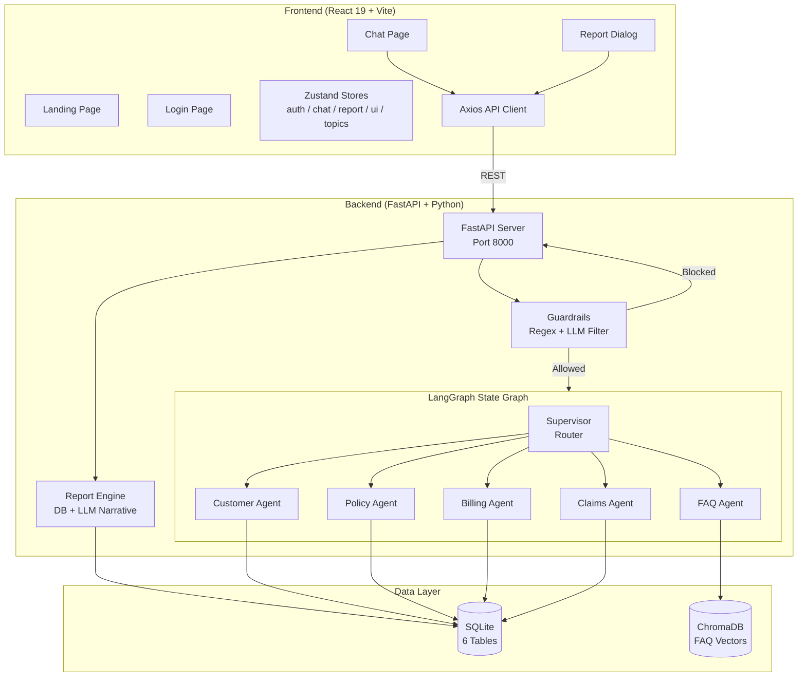
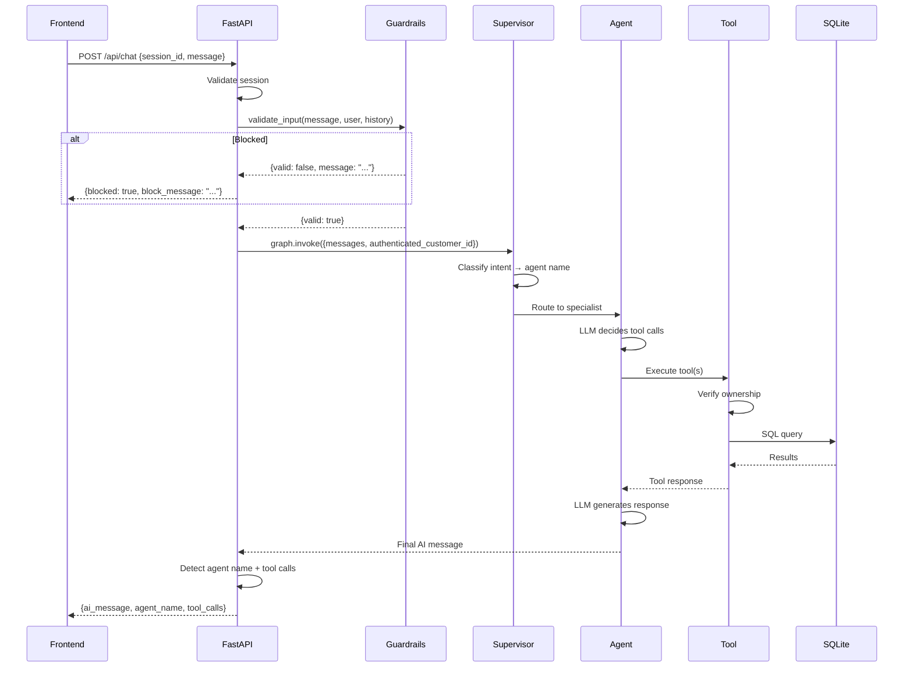
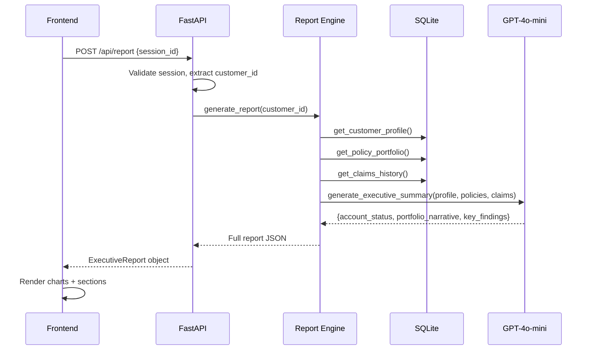

# Architecture

InsureAI follows a **client-server architecture** with a React SPA frontend and a FastAPI backend that orchestrates a LangGraph multi-agent workflow.

## System Overview



## Request Lifecycle

### Chat Message Flow



### Report Generation Flow



## Key Architectural Patterns

### 1. Supervisor-Worker Pattern

The supervisor agent doesn't process queries — it only classifies and routes. This keeps routing logic separate from domain logic.

```python
# Supervisor uses structured output for routing
class RouterOutput(BaseModel):
    next: Literal["customer_agent", "policy_agent", "claims_agent",
                   "billing_agent", "faq_agent", "FINISH"]
```

### 2. Agent-Tool Loop

Each agent can call tools multiple times in a loop. The graph handles this with conditional edges:

```
Agent Node → has tool_calls? → Yes → Tool Node → back to Agent Node
                              → No  → END
```

### 3. Security-by-Default

The `SecureToolNode` wrapper ensures the `authenticated_customer_id` is always available to tools, without agents needing to manage it explicitly.

### 4. Session-Based State

Conversation history is stored server-side in a Python dictionary. The frontend only holds the `session_id`.

### 5. Report Caching

The frontend Zustand store caches generated reports. Subsequent requests in the same session reuse the cached data. Cache clears on new conversation or sign-out.
