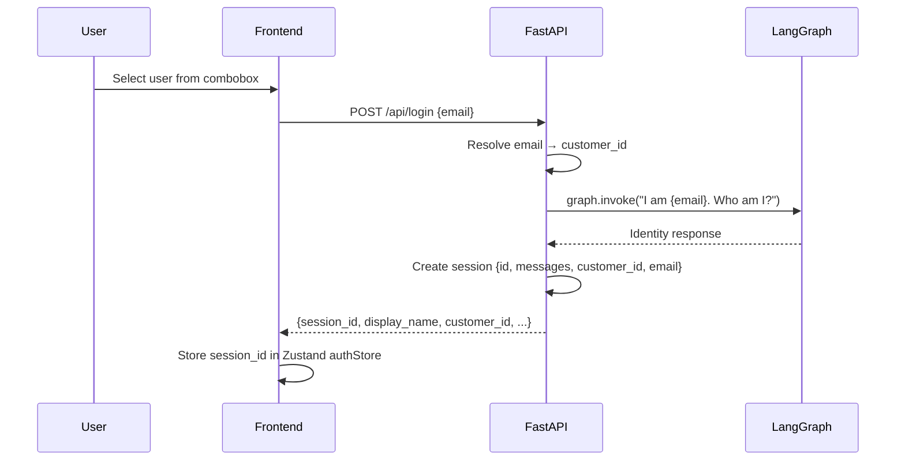

# Authentication

InsureAI uses **session-based authentication** with email-only login. This is a demo-grade authentication system designed to showcase the data access security model.

## Authentication Flow



## Session Structure

Each session is a server-side dictionary entry:

```python
sessions[session_id] = {
    "messages": [...],                  # Full LangGraph message history
    "authenticated_customer_id": "CUST001",  # Used by all tools
    "email": "john.doe@email.com",      # Used by guardrails
    "display_name": "John Doe",         # UI metadata
    "policy_type": "Motor",             # UI metadata
}
```

## How Tools Use Authentication

Every database tool receives the `authenticated_customer_id` through the `SecureToolNode` wrapper:

```python
class SecureToolNode:
    def __call__(self, state, config=None):
        config = {**config, "configurable": {
            **config.get("configurable", {}),
            "authenticated_customer_id": state.get("authenticated_customer_id", "")
        }}
        return self.tool_node.invoke(state, config)
```

Inside each tool, the ownership check:

```python
@tool
def get_customer_policies(customer_id: str, config: RunnableConfig = None):
    auth_id = config.get("configurable", {}).get("authenticated_customer_id", "")
    if auth_id and customer_id != auth_id:
        return "Access denied. You can only view your own policies."
    # ... proceed with query
```

## Security Guarantees

| Scenario | Result |
|----------|--------|
| User asks about their own data | Allowed — IDs match |
| LLM hallucinates a different customer_id | Blocked — tool checks ownership |
| User mentions another person's name | Blocked — guardrail rejects the message |
| User tries SQL injection | Blocked — regex pre-filter catches it |
| Session expires / invalid | HTTP 401 returned |

## Limitations

::: warning
This authentication system is for **demo purposes only**. It has the following limitations:

- **No password** — Login requires only an email address
- **In-memory sessions** — Sessions are lost on server restart
- **No token expiration** — Sessions persist until server shutdown
- **Single-server only** — Sessions are not shared across instances

See the [Production Checklist](/deployment/production-checklist) for recommended production auth.
:::
