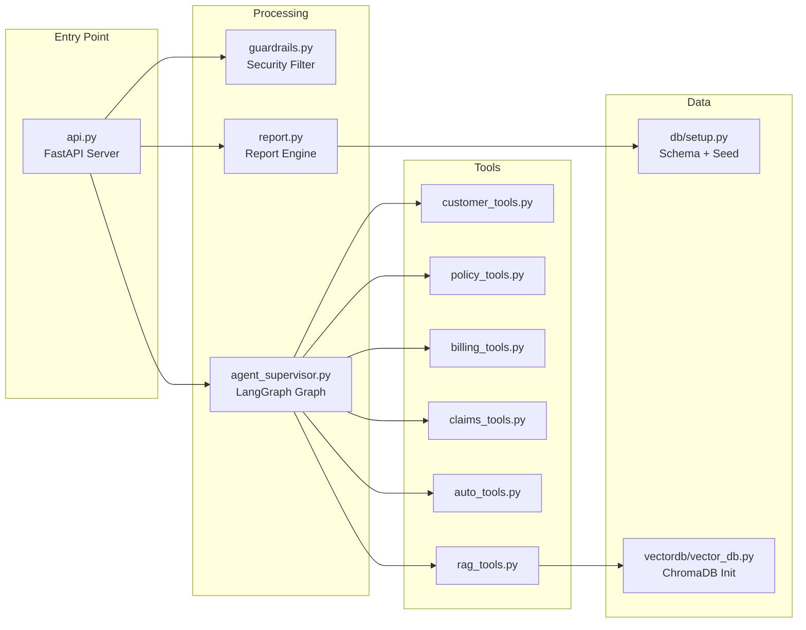

# Modules Overview

## Backend Modules

The backend is organized as a flat Python module structure under `backend/`.



### Module Responsibilities

| Module | Purpose | Key Functions/Classes |
|--------|---------|----------------------|
| `api.py` | HTTP server, session management, response shaping | `login()`, `chat()`, `get_report()`, `detect_agent()` |
| `agent_supervisor.py` | LangGraph state graph definition | `supervisor_node()`, `AgentState`, `SecureToolNode`, `RouterOutput` |
| `guardrails.py` | Input validation before agent processing | `validate_input()`, `GuardrailVerdict` |
| `report.py` | Executive report data assembly + LLM narrative | `generate_report()`, `ExecutiveSummary` |
| `customer_tools.py` | Customer identity lookup | `lookup_customer()` |
| `policy_tools.py` | Policy data retrieval with ownership checks | `get_customer_policies()`, `get_policy_details()` |
| `billing_tools.py` | Billing and invoice data | `get_billing_history()` |
| `claims_tools.py` | Claims lifecycle management | `get_customer_claims()`, `check_claim_status()`, `file_new_claim()` |
| `auto_tools.py` | Vehicle details for motor policies | `get_vehicle_details()` |
| `rag_tools.py` | FAQ semantic search via ChromaDB | `search_faq()` |
| `db/setup.py` | Database schema creation + synthetic data | `create_tables()`, `generate_customers()` |
| `vectordb/vector_db.py` | ChromaDB collection initialization | Embeds 22 FAQs on startup |

---

## Frontend Modules

The frontend follows a feature-based structure under `frontend/src/`.

### Layer Architecture

```
Pages (LandingPage, LoginPage, ChatPage)
  └── Components (ChatContainer, ReportDialog, etc.)
      └── UI Primitives (Button, Card, Dialog, etc.)
          └── Stores (authStore, chatStore, reportStore)
              └── API Layer (client.ts, chatApi.ts, reportApi.ts)
                  └── Types (index.ts)
```

### Module Map

| Layer | Directory | Files | Purpose |
|-------|-----------|-------|---------|
| **Pages** | `pages/` | 3 | Route-level components |
| **API** | `api/` | 4 | Axios client + endpoint functions |
| **Stores** | `stores/` | 5 | Zustand global state |
| **Types** | `types/` | 1 | TypeScript interfaces |
| **Chat Components** | `components/chat/` | 10 | Chat interface elements |
| **Report Components** | `components/report/` | 5 + 4 sections | Report dialog and sections |
| **Auth Components** | `components/auth/` | 2 | Login UI |
| **Landing Components** | `components/landing/` | 4 | Landing page sections |
| **Layout Components** | `components/layout/` | 3 | App shell (header, footer) |
| **UI Primitives** | `components/ui/` | ~15 | shadcn/ui base components |

### State Management Map

| Store | Scope | Key State |
|-------|-------|-----------|
| `authStore` | Authentication | `user`, `sessionId`, `isAuthenticated` |
| `chatStore` | Chat messages | `messages[]`, `isTyping` |
| `reportStore` | Report data | `report`, `isOpen`, `isLoading`, `error` |
| `uiStore` | UI toggles | `sidebarOpen` |
| `topicsStore` | Quick actions | `topics[]` (persisted in localStorage) |
