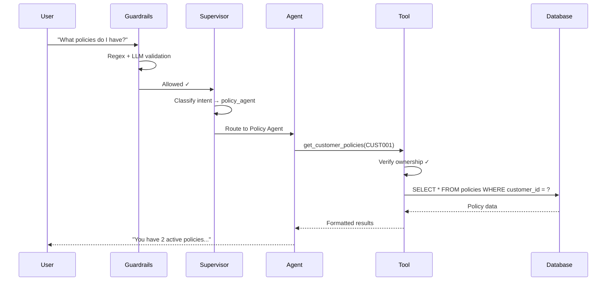

# What is InsureAI?

InsureAI is a conversational AI assistant purpose-built for insurance customer support. It uses a **multi-agent architecture** powered by [LangGraph](https://langchain-ai.github.io/langgraph/) to route customer queries to specialized domain agents — each with access to the right tools, data, and security context.

- **Multi-Agent System** — Five specialized agents (Customer, Policy, Billing, Claims, FAQ) orchestrated by a supervisor LLM
- **Three-Layer Security** — Regex pre-filter, LLM semantic guard, and tool-level ownership verification
- **Executive Reports** — AI-generated summary reports with interactive charts and PDF export
- **Singapore Market** — Tailored for Singapore insurance — NCD, COE, GIRO, PayNow, MAS terms

## Who is this for?

| Audience | Use Case |
|----------|----------|
| **Developers** | Learn multi-agent LLM architecture patterns with LangGraph |
| **AI/ML Engineers** | Reference implementation for tool-calling agents with guardrails |
| **Business Analysts** | Understand how AI can automate insurance support workflows |
| **Insurance Professionals** | Demo an AI assistant tailored for Singapore insurance operations |

## Key Benefits

- **Instant Routing** — The supervisor agent classifies intent and dispatches to the right specialist in milliseconds
- **Data Security** — Every database tool verifies that the authenticated user owns the data they're requesting
- **Transparent AI** — Tool call tracing shows exactly which tools executed and what arguments were used
- **Report Generation** — One-click executive summary with LLM-generated narrative, charts, and PDF export
- **Production Patterns** — Session management, guardrails, structured output, and error handling

## How It Works (30-Second Summary)

## Quick Links

- **[Quickstart](/quickstart/quickstart)** — Get running in 5 minutes
- **[Architecture](/architecture/architecture)** — System design deep-dive
- **[API Reference](/api/rest-api)** — REST endpoint documentation
