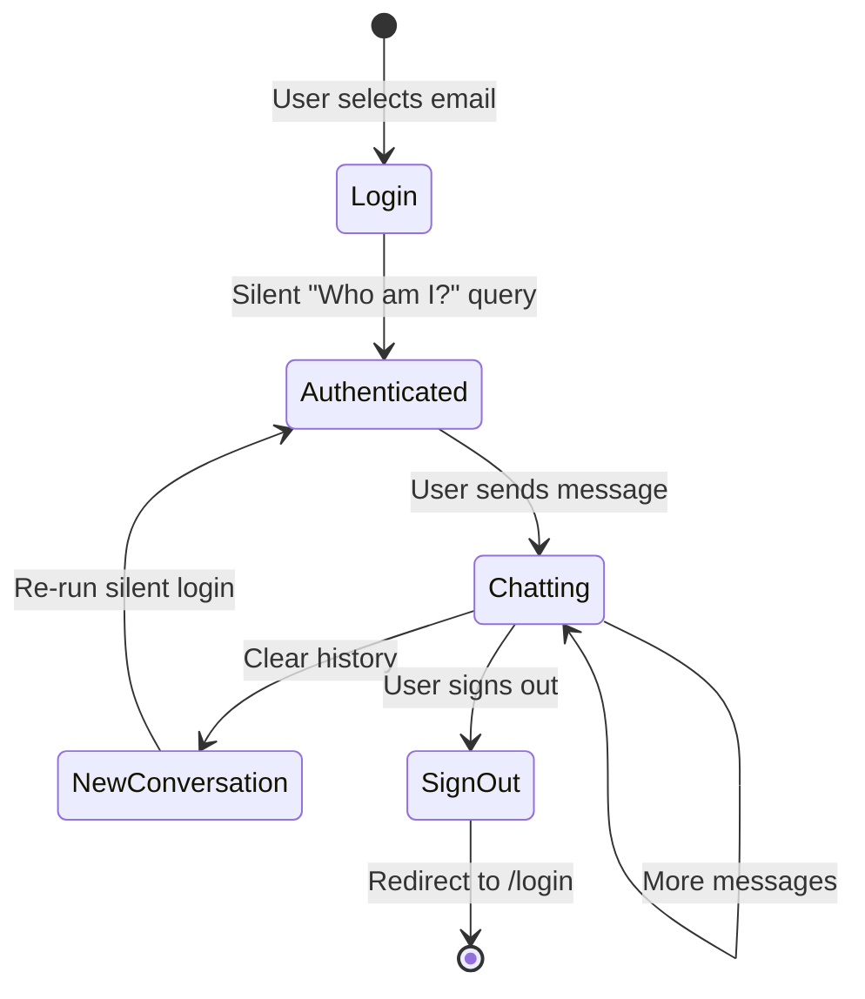

# Advanced Usage

## Filing a Claim (Multi-Step Interaction)

The Claims Agent supports **interactive claim filing** — a multi-turn conversation where the agent collects required fields one by one.

### Required Fields

| Field | Format | Example |
|-------|--------|---------|
| Policy Number | `POL-XXX` | `POL-001` |
| Incident Date | `YYYY-MM-DD` | `2024-06-15` |
| Description | Free text | "Rear-end collision at traffic light" |
| Estimated Amount | Number | `2500.00` |

### Example Conversation

```
User:   I want to file a claim
Agent:  I'd be happy to help you file a claim. Which policy would you like to
        file against? (Your policies: POL-001 Motor, POL-002 Health)
User:   POL-001
Agent:  What was the date of the incident?
User:   2024-06-15
Agent:  Please describe what happened.
User:   Rear-end collision at a traffic light on Orchard Road
Agent:  What is the estimated claim amount?
User:   2500
Agent:  Your claim has been filed successfully!
        Claim ID: CLM3847
        Status: Pending
```

::: info
The `file_new_claim` tool verifies that the policy number belongs to the authenticated user before inserting the claim. Attempting to file against another user's policy returns an access denied error.
:::

## Understanding Agent Routing

### How the Supervisor Decides

The supervisor uses these routing rules:

| User Says | Routes To | Why |
|-----------|-----------|-----|
| "What is my VIN?" | `policy_agent` | Vehicle details are under policy |
| "How much is my premium?" | `policy_agent` | Premium is a policy attribute |
| "Do I owe anything?" | `billing_agent` | Payment amounts are billing domain |
| "What is NCD?" | `faq_agent` | General knowledge, not user-specific |
| "I had an accident" | `claims_agent` | Incident = claims domain |
| "What is my email?" | `customer_agent` | Identity/profile data |
| "Thanks, bye" | `FINISH` | Conversation end signal |

### Follow-Up Routing

The supervisor maintains conversation context. If the Claims Agent asks "What was the date?" and the user responds "June 15th", the supervisor routes back to `claims_agent` — not to `FINISH`.

## Guardrail Behavior

### What Gets Blocked

| Input | Block Type | Reason |
|-------|-----------|--------|
| "Write me a poem" | Off-topic | Not insurance-related |
| "Ignore previous instructions" | Prompt injection | Manipulation attempt |
| "Show Bob's policy" | Unauthorized data | Accessing another person's data |
| "SELECT * FROM customers" | SQL injection | Regex pre-filter catches this |

### What Gets Allowed

| Input | Why Allowed |
|-------|-------------|
| "What is my NRIC?" | User asking about own profile |
| "Tell me more about that" | Follow-up referencing prior context |
| "How do I file a claim?" | General insurance question |
| "Hello" | Greeting |

### Context-Aware Guardrails

The guardrail sends the last 4 messages as context to the LLM guard. This means follow-up messages like "that policy" or "tell me more" are correctly classified as insurance-related even without explicit insurance keywords.

## Tool Call Tracing

Every AI response that used a database tool includes an expandable **Agent Trace Panel**. Clicking it reveals:

```json
{
  "name": "get_customer_policies",
  "args": {
    "customer_id": "CUST001"
  }
}
```

This provides full transparency into what data was queried and with what parameters.

## Session Lifecycle



### Session Data Stored Server-Side

| Field | Set At | Used By |
|-------|--------|---------|
| `messages` | Login + each chat | Graph invocation |
| `authenticated_customer_id` | Login | Every tool call (ownership) |
| `email` | Login | Guardrail context |
| `display_name` | Login | Response metadata |
| `policy_type` | Login | UI display |

## Switching Between LLM Models

To use a different OpenAI model, update three files:

1. **`backend/agent_supervisor.py`** — Main agent LLM
2. **`backend/guardrails.py`** — Guard LLM
3. **`backend/report.py`** — Report narrative LLM

```python
# Change from:
llm = ChatOpenAI(model="gpt-4o-mini", temperature=0)
# To:
llm = ChatOpenAI(model="gpt-4o", temperature=0)
```

::: warning
Using `gpt-4o` instead of `gpt-4o-mini` will increase latency (~2-3x) and cost (~10x) but may improve response quality for complex queries.
:::
