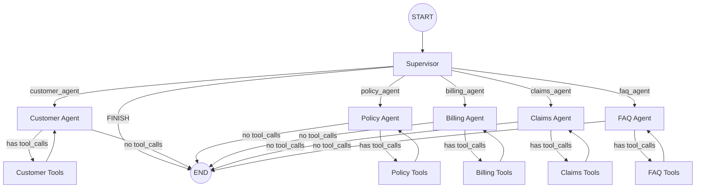

# Agents & Pipelines

## LangGraph State Graph

The entire agent system is defined as a LangGraph `StateGraph` in `backend/agent_supervisor.py`.

### State Definition

```python
class AgentState(TypedDict):
    messages: Annotated[List, add_messages]   # Conversation history (appended)
    next: str                                  # Supervisor routing decision
    authenticated_customer_id: str             # Security context from session
```

### Graph Topology



## Supervisor Agent

The supervisor is a routing-only node. It doesn't answer questions — it classifies intent.

### Routing Logic

```python
class RouterOutput(BaseModel):
    next: Literal[
        "customer_agent", "policy_agent", "claims_agent",
        "billing_agent", "faq_agent", "FINISH"
    ]
```

The supervisor uses `llm.with_structured_output(RouterOutput)` to guarantee the response is one of the valid routing targets.

### Routing Rules

| Intent Pattern | Routes To |
|---------------|-----------|
| Login, profile, "Who am I?" | `customer_agent` |
| Policy details, coverage, vehicles, VIN, premiums | `policy_agent` |
| Invoices, payments, amounts owed | `billing_agent` |
| Accidents, claims, filing reports | `claims_agent` |
| General definitions, "What is NCD?", FAQs | `faq_agent` |
| "Goodbye", "Thanks", "Done" | `FINISH` |

### Follow-Up Handling

The supervisor prompt includes a critical rule: if an agent previously asked a question (e.g., "What is the date of the incident?"), the supervisor must route the user's response **back to that agent**, not to `FINISH`.

---

## Specialist Agents

Each specialist is a Python function that:

1. Creates a tool-bound LLM instance
2. Invokes it with the full message history
3. Returns the LLM's response (which may include tool calls)

### Customer Agent

```python
def customer_agent_node(state: AgentState):
    agent = llm.bind_tools([lookup_customer])
    res = agent.invoke(state["messages"])
    return {"messages": [res]}
```

**Tools:** `lookup_customer`
**Scope:** Identity verification, profile queries

### Policy Agent

```python
def policy_agent_node(state: AgentState):
    agent = llm.bind_tools([get_customer_policies, get_policy_details, get_vehicle_details])
    res = agent.invoke(state["messages"])
    return {"messages": [res]}
```

**Tools:** `get_customer_policies`, `get_policy_details`, `get_vehicle_details`
**Scope:** Policy details, coverage info, vehicle data (motor policies)

### Billing Agent

```python
def billing_agent_node(state: AgentState):
    instructions = """You are the Billing Agent.
    1. Use 'get_billing_history' to see status.
    2. If user sees an UNPAID bill and wants to pay, say:
       "I will connect you to a secure human agent for payment."
    """
    agent = llm.bind_tools([get_billing_history])
    res = agent.invoke([SystemMessage(content=instructions)] + state["messages"])
    return {"messages": [res]}
```

**Tools:** `get_billing_history`
**Scope:** Invoice status, payment history, amounts due
**Special:** Has a system instruction to redirect payment processing to a human agent

### Claims Agent

```python
def claims_agent_node(state: AgentState):
    agent = llm.bind_tools([get_customer_claims, check_claim_status, file_new_claim])
    res = agent.invoke(state["messages"])
    return {"messages": [res]}
```

**Tools:** `get_customer_claims`, `check_claim_status`, `file_new_claim`
**Scope:** View claims, check status, file new claims (interactive multi-turn)

### FAQ Agent

```python
def faq_agent_node(state: AgentState):
    agent = llm.bind_tools([search_faq])
    res = agent.invoke(state["messages"])
    return {"messages": [res]}
```

**Tools:** `search_faq` (ChromaDB semantic search)
**Scope:** General insurance knowledge, Singapore-specific terms

---

## Tool-Agent Loop

The conditional edge logic determines whether an agent needs to execute tools:

```python
def basic_logic(state, tool_node):
    if getattr(state["messages"][-1], "tool_calls", None):
        return tool_node   # Execute tools, then return to agent
    return END             # No tools needed, finish
```

This creates a loop: Agent → Tool Node → Agent → (until no more tool calls) → END.

---

## SecureToolNode

The `SecureToolNode` wraps LangGraph's `ToolNode` to inject the authenticated customer ID:

```python
class SecureToolNode:
    def __init__(self, tools):
        self.tool_node = ToolNode(tools)

    def __call__(self, state: AgentState, config: RunnableConfig = None):
        config = config or {}
        config = {**config, "configurable": {
            **config.get("configurable", {}),
            "authenticated_customer_id": state.get("authenticated_customer_id", "")
        }}
        return self.tool_node.invoke(state, config)
```

### Which Nodes Use SecureToolNode?

| Tool Node | Wrapper | Reason |
|-----------|---------|--------|
| `customer_tools` | `ToolNode` | Lookup by email, no ownership check needed |
| `policy_tools` | `SecureToolNode` | Verifies policy belongs to user |
| `claims_tools` | `SecureToolNode` | Verifies claim/policy ownership |
| `billing_tools` | `SecureToolNode` | Verifies billing record ownership |
| `faq_tools` | `ToolNode` | Public knowledge, no ownership needed |

---

## Adding a New Agent

To add a sixth specialist agent:

1. **Create tool file** (e.g., `support_tools.py`) with `@tool` decorated functions
2. **Add agent node** in `agent_supervisor.py`:
   ```python
   def support_agent_node(state: AgentState):
       agent = llm.bind_tools([your_tool])
       res = agent.invoke(state["messages"])
       return {"messages": [res]}
   ```
3. **Add tool node**: `workflow.add_node("support_tools", SecureToolNode([your_tool]))`
4. **Add agent node**: `workflow.add_node("support_agent", support_agent_node)`
5. **Add edges**:
   ```python
   workflow.add_conditional_edges("support_agent", lambda x: basic_logic(x, "support_tools"))
   workflow.add_edge("support_tools", "support_agent")
   ```
6. **Update RouterOutput** to include `"support_agent"` as a routing option
7. **Update supervisor prompt** with routing rules for the new agent
8. **Update AGENT_MAP** in `api.py` for agent detection
